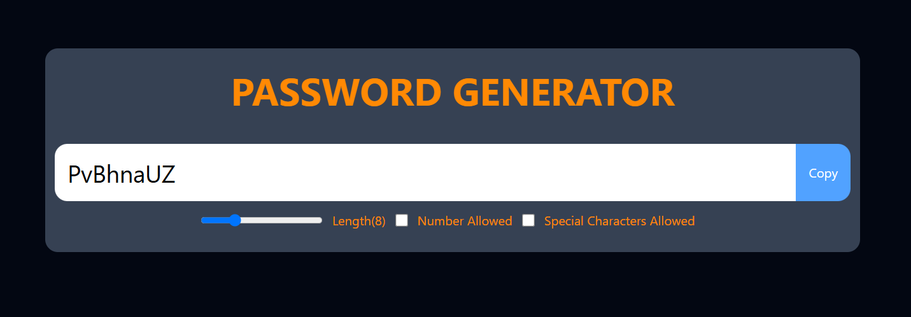

# Password Generator

A React.js application that generates secure, random passwords based on user-defined criteria.

## Features

- **Customizable Password Length**: Specify the desired length of the password.
- **Character Options**: Include or exclude:
  - Numbers
  - Special characters
- **Clipboard Functionality**: Easily copy the generated password to your clipboard with a single click.

## Demo



## Installation

1. **Clone the Repository**:

   ```bash
   git clone https://github.com/CharlieCoder404/password_generator.git
   cd password_generator
   ```

2. **Install Dependencies**:

   Ensure you have [Node.js](https://nodejs.org/) and [npm](https://www.npmjs.com/) installed. Then, run:

   ```bash
   npm install
   ```

3. **Start the Application**:

   ```bash
   npm start
   ```


## Usage

1. **Set Password Criteria**:
   - Adjust the slider to set the password length.
   - Use the checkboxes to include or exclude character types.

2. **Generate Password**:
   - Click the "Generate Password" button to create a new password based on the selected criteria.

3. **Copy to Clipboard**:
   - Click the "Copy" button to copy the generated password to your clipboard.

## Technologies Used

- **React.js**: Front-end library for building user interfaces.
- **CSS Modules**: For styling components.
- **Vite**: Build tool for faster and leaner development.

## Contributing

Contributions are welcome! Please follow these steps:

1. Fork the repository.
2. Create a new branch: `git checkout -b feature/YourFeature`
3. Commit your changes: `git commit -m 'Add YourFeature'`
4. Push to the branch: `git push origin feature/YourFeature`
5. Open a pull request.


## Acknowledgements

- Inspired by various password generator tools and applications.
